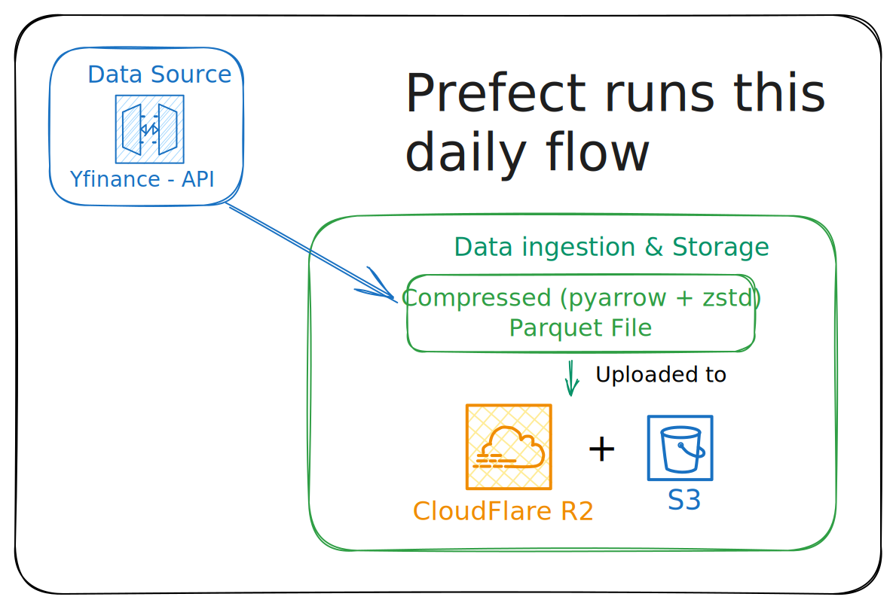

# Stockpulse
An end-to-end Data Engineering + AI pipeline that ingests live market data using yfinance, transforms and models it with dbt + DuckDB, detects market anomalies in real time, and lets you query insights in plain English through a local LLM-powered interface.

